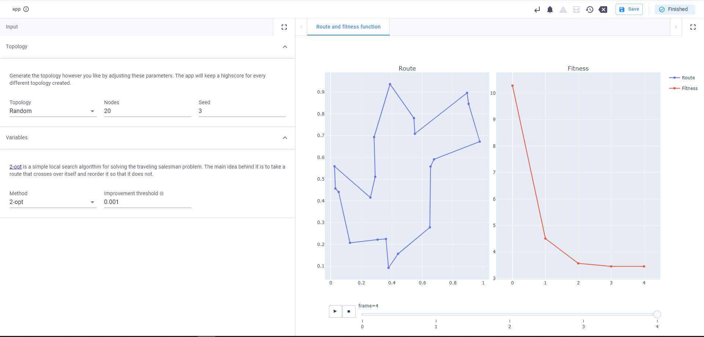

 <Please check version is the same as specified in requirements.txt>
# sample-traveling-salesman-problem

The [traveling salesman problem](https://en.wikipedia.org/wiki/Travelling_salesman_problem) is a popular subject when discussing [NP-hard](https://en.wikipedia.org/wiki/NP-hardness) problems. An screenshot of the application is shown in the figure above. There are a lot of different approaches to solving this problem. The goal of this app is to showcase some of these approaches inside the VIKTOR environment. While no new approach is developed in this app, the app will allow you to play with the different algorithms so you can try to get the best solution for a generated topology.

### 2-opt

The first and easiest algorithm to be implemented in this app is the [2-opt](https://en.wikipedia.org/wiki/2-opt) local search algorithm. This algorithm detects if the route crosses over itself and if it does it tries to reorder itself so that it does not.

### Genetical Algorithm

The [Genetical Algorithm](https://towardsdatascience.com/evolution-of-a-salesman-a-complete-genetic-algorithm-tutorial-for-python-6fe5d2b3ca35) (GA) is an [evolutionary algorithm](https://towardsdatascience.com/introduction-to-evolutionary-algorithms-a8594b484ac) that is based on Charles Darwin's theory of natural evolution. After initializing the population (which is defined as different possible routes) we select the fittest individuals and combine them to get new, and hopefully better, solutions. We can also implement random mutations in the population. This is helpful because otherwise there is a chance that the solution will never improve. After all, we keep having the same individuals when breeding.

### Self-organizing maps

The [self-organizing maps](https://diego.codes/post/som-tsp/) algorithm implements a neural network that is closely related to the topology we generate. The purpose of the technique is to represent the model with a lower number of dimensions while maintaining the relations of similarity of the nodes contained in it. The algorithm used in this app generates a circular array of neurons, behaving as an elastic ring. During the execution of the algorithm, the neurons are searching for cities closest to their neighborhood. The ring then warps around the cities. To ensure convergence we can add a learning rate to the algorithm. The higher the rate the more the neurons will move, but we might want to make the algorithm less aggressive the longer it runs. Because of this, we can also add decay to the learning rate.

## App structure 
This is an editor-only app type.

